# Selenium Automation Project

## Overview

This project automates UI elements on a practice website using Selenium WebDriver with Java. It demonstrates handling of forms, date pickers, file uploads, alerts, and advanced user interactions.

---

## Project Structure

## Project Structure

```id="nq3z1p"
Selenium_CapstoneProject/
│
├── pom.xml                          ← Maven build file (dependencies, plugins)
│
├── Screenshots/                     ← Stores all execution screenshots
│   └── TC001.png ... TC019.png      ← One image per test case
│
├── src/
│   └── main/
│       └── java/
│           └── riyaz_wipro/
│               └── CapstoneProject/
│                   └── MainCapstone.java  ← Main automation script
│
├── .gitignore                       ← Excludes unwanted files from Git
│
└── README.md                        ← Project documentation
```

---

## File Breakdown

MainCapstone.java

* Main automation script
* Covers all UI interactions in one execution flow

---

## Features Implemented

Form Handling

* Input fields: name, email, phone, address

Selection Handling

* Radio buttons
* Checkboxes
* Dropdowns

Date Pickers

* Standard input date
* Read-only field using JavaScriptExecutor
* Date range picker using JavaScript

File Upload

* Single file upload
* Multiple file upload

User Actions

* Double click
* Mouse hover
* Drag and drop
* Slider movement

Alerts Handling

* Simple alert
* Confirm alert
* Prompt alert

JavaScript Execution

* Scroll down
* Scroll up

---

## Tech Stack

* Java
* Selenium WebDriver
* WebDriverManager
* ChromeDriver

---

## How to Run

1. Clone the repository
2. Open in Eclipse or IntelliJ
3. Run MainCapstone.java

---
## Test Cases with Screenshots

| #  | Test ID | Element           | Action Description                              | Expected Result              | Screenshot                        |
| -- | ------- | ----------------- | ----------------------------------------------- | ---------------------------- | --------------------------------- |
| 1  | TC001   | Name field        | Enter text using sendKeys                       | Name entered successfully    | 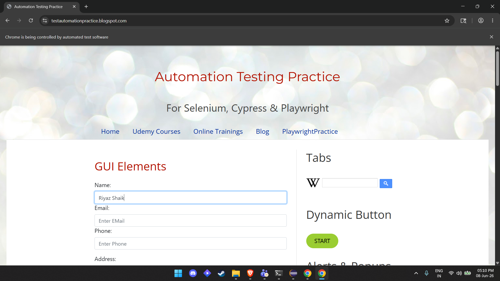 |
| 2  | TC002   | Email field       | Enter text using sendKeys                       | Email entered successfully   | 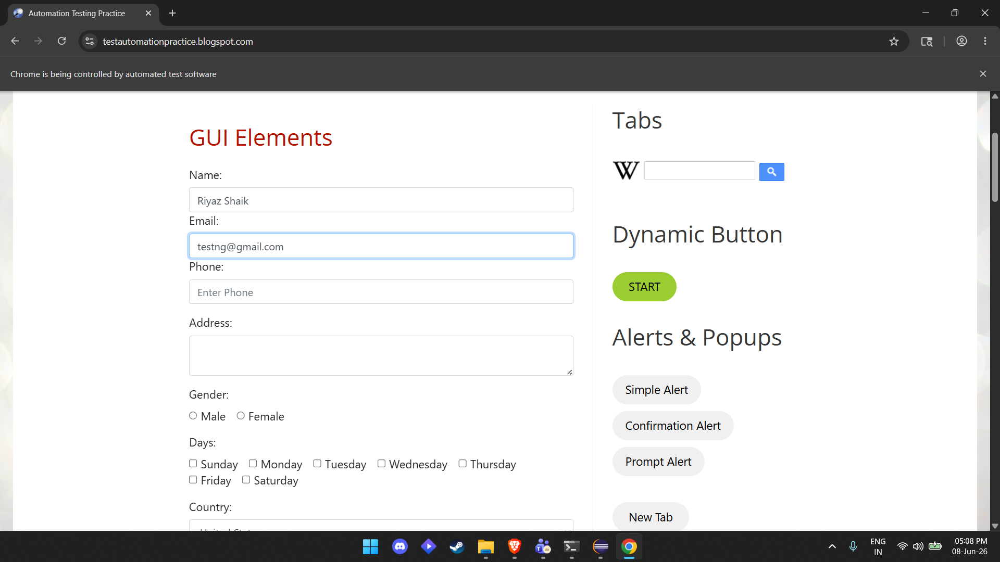 |
| 3  | TC003   | Phone field       | Enter text using sendKeys                       | Phone number entered         | 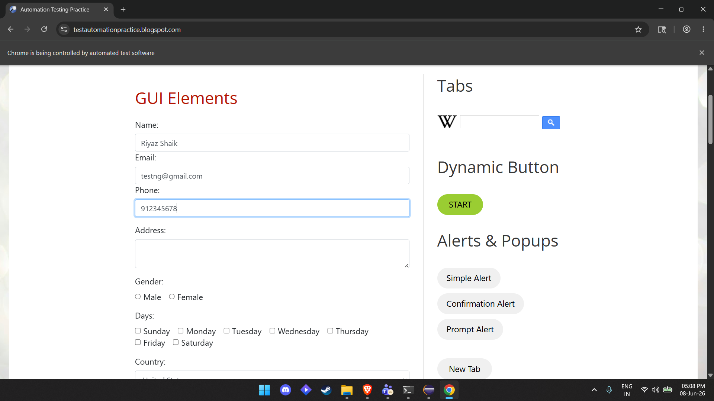 |
| 4  | TC004   | Address textarea  | Enter text using sendKeys                       | Address entered              | 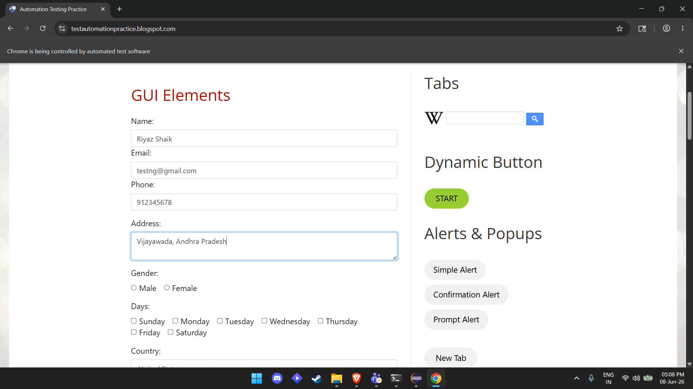 |
| 5  | TC005   | Gender radio      | Click if not already selected                   | Gender selected              | 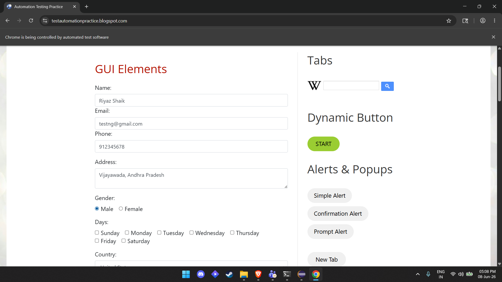 |
| 6  | TC006   | Days checkboxes   | Select Monday, Wednesday, Friday                | Checkboxes selected          |  |
| 7  | TC007   | Dropdowns         | Select Country, Color, Animal                   | Values selected correctly    | 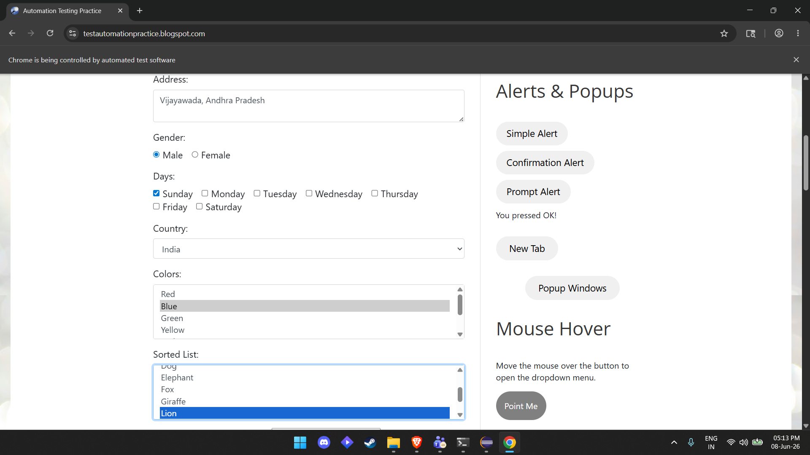 |
| 8  | TC008   | Date Picker 1 & 2 | Set dates using sendKeys and JavaScriptExecutor | Dates set correctly          | 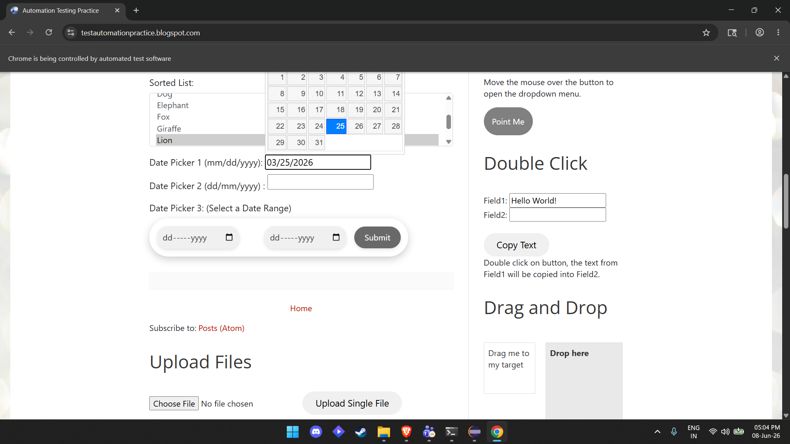 |
| 9  | TC009   | Date Picker 3     | Set start and end date using JavaScript         | Date range set correctly     | 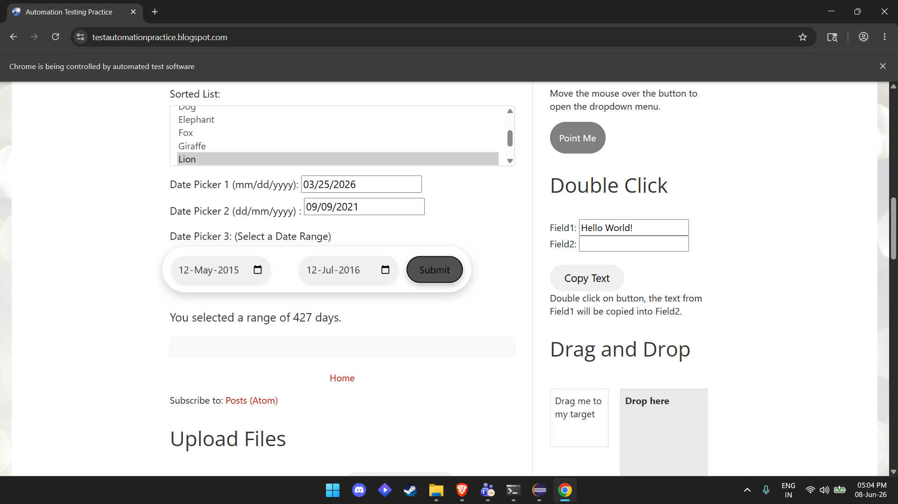 |
| 10 | TC010   | File upload       | Upload file using sendKeys                      | File uploaded successfully   | 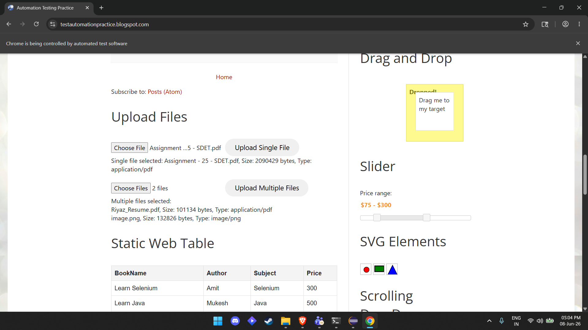 |
| 11 | TC011   | Slider            | Move slider using arrow keys                    | Slider moved                 | 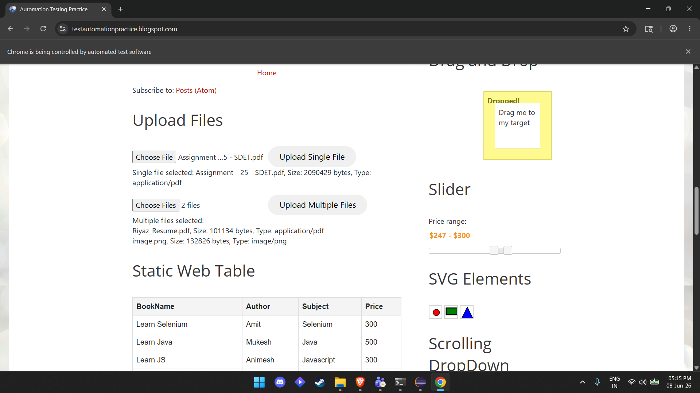 |
| 12 | TC012   | Simple alert      | Accept alert                                    | Alert handled                | 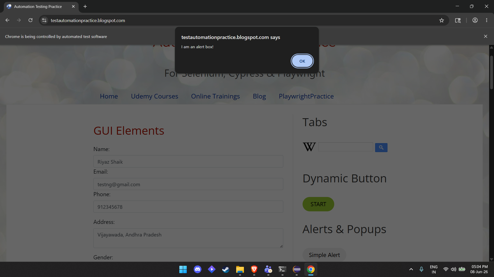 |
| 13 | TC013   | Confirm alert     | Accept confirmation                             | Alert handled                | 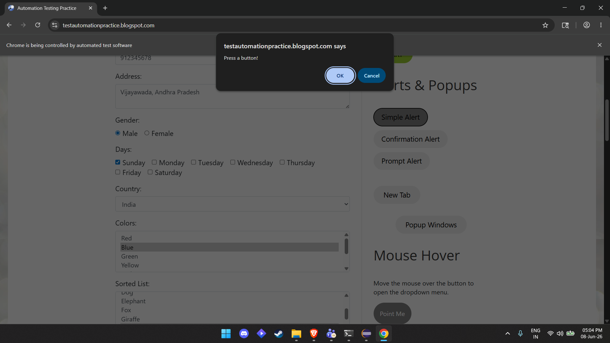 |
| 14 | TC014   | Prompt alert      | Enter text and accept                           | Input submitted              | 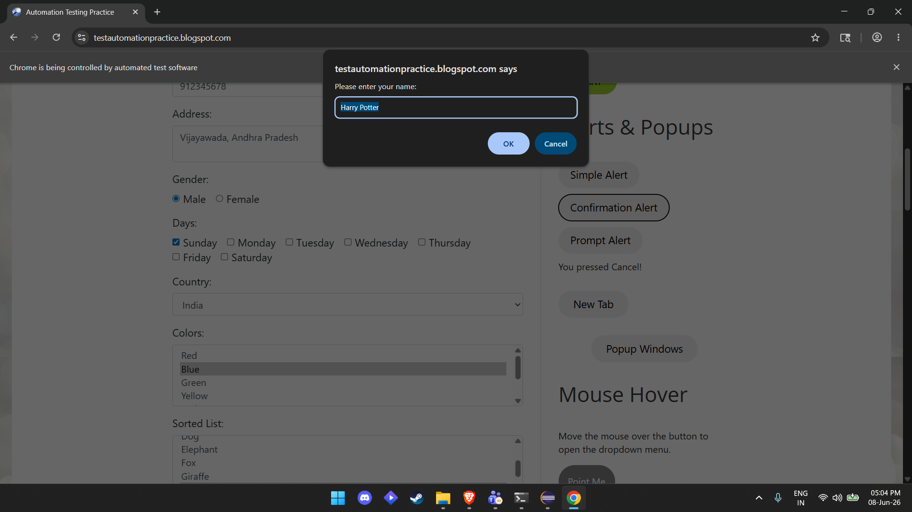 |
| 15 | TC015   | Mouse hover       | Hover and click “Mobiles”                       | Menu option selected         | 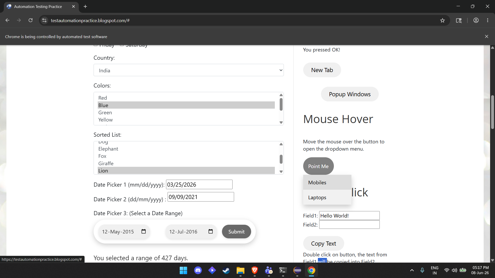 |
| 16 | TC016   | Double click      | Copy text from Field1 to Field2                 | Text copied successfully     | 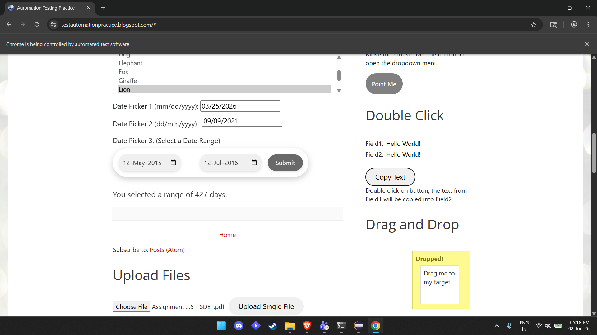 |
| 17 | TC017   | Drag and Drop     | Drag source element to target                   | Element dropped successfully | 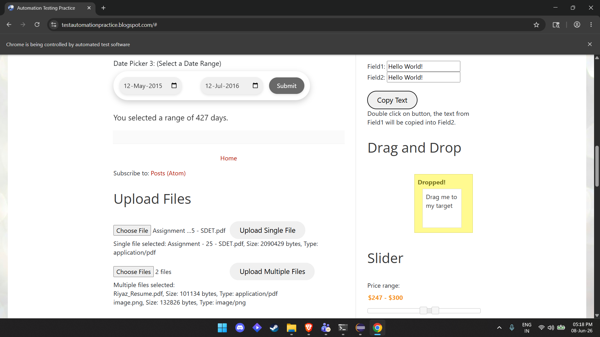 |
| 18 | TC018   | Scroll Down       | Scroll to bottom using JavaScriptExecutor       | Page scrolled to bottom      | 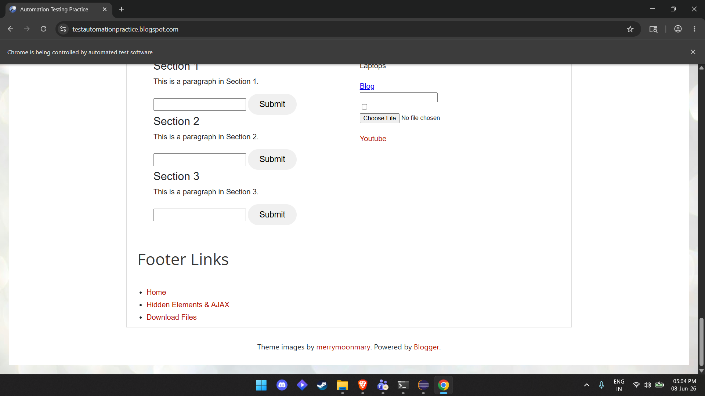 |
| 19 | TC019   | Scroll Up         | Scroll to top using JavaScriptExecutor          | Page scrolled to top         | 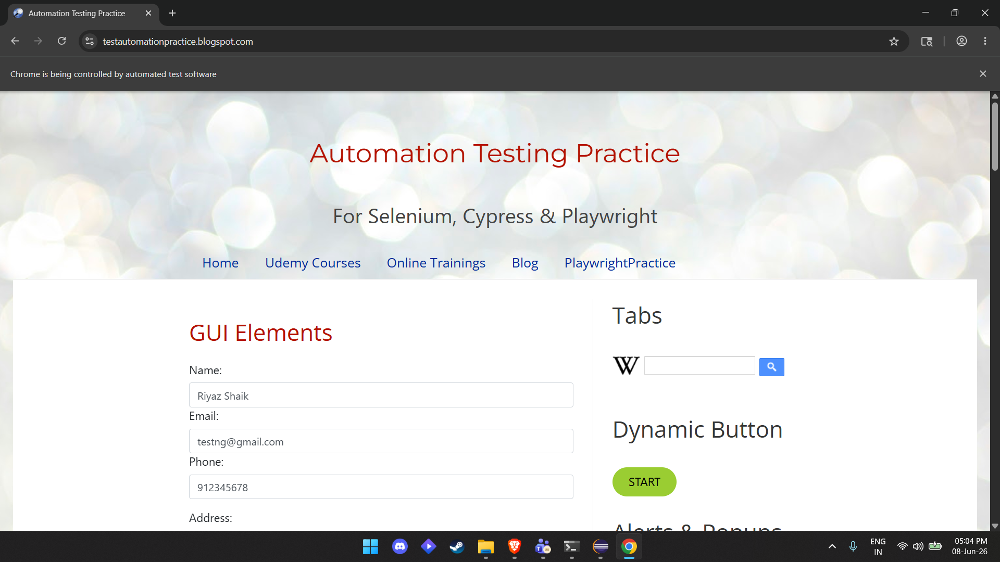 |

---

## Key Learning

* Handling different types of date pickers
* Working with dynamic elements
* Using JavaScriptExecutor for edge cases
* Performing advanced UI interactions
* Structuring Selenium automation projects

---

## Author

Riyaz Shaik
